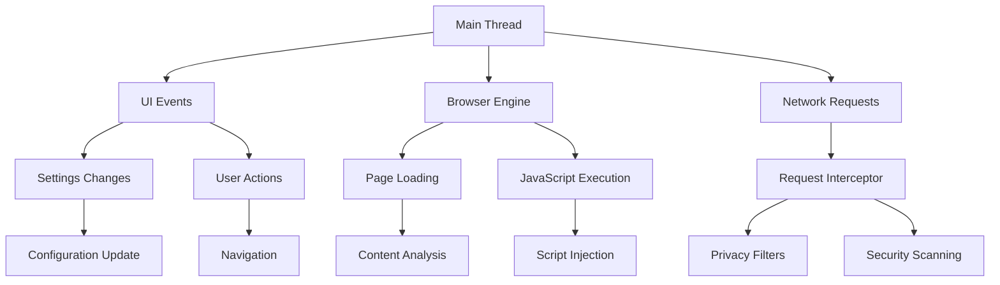

# API Документація AnDetect Browser

Цей документ описує внутрішні API та архітектуру AnDetect Browser для розробників, які хочуть розширити або інтегрувати з браузером.

## 📋 Зміст

- [Архітектура](#архітектура)
- [Основні класи](#основні-класи)
- [Privacy Protection API](#privacy-protection-api)
- [Tor Integration API](#tor-integration-api)
- [Security Scanner API](#security-scanner-api)
- [Data Cleaner API](#data-cleaner-api)
- [Events та Signals](#events-та-signals)
- [Конфігурація](#конфігурація)
- [Розширення](#розширення)

## 🏗️ Архітектура

### Загальна структура

```
AnDetect Browser
├── AnDetectBrowser (Main Window)
│   ├── BrowserTab (Individual Tabs)
│   ├── SettingsDialog (Configuration)
│   └── SecurityStatusDialog (Security Info)
├── PrivacyManager (Privacy Protection)
│   ├── TrackingBlocker
│   ├── FingerprintProtection
│   └── RequestInterceptor
├── AnonymityManager (Tor & Proxy)
│   ├── TorController
│   └── ProxyManager
├── SecurityScanner (Threat Detection)
│   ├── URLAnalyzer
│   ├── CertificateValidator
│   └── MalwareScanner
└── DataCleaner (Data Cleanup)
    ├── CleanupThread
    └── ScheduledCleaner
```

### Потоки виконання



## 🔧 Основні класи

### AnDetectBrowser

Головний клас браузера, що управляє всіма компонентами.

```python
class AnDetectBrowser(QMainWindow):
    """Головний клас браузера"""
    
    def __init__(self):
        """Ініціалізація браузера"""
        
    def new_tab(self, url: str = "") -> BrowserTab:
        """Створення нової вкладки"""
        
    def close_tab(self, index: int) -> None:
        """Закриття вкладки"""
        
    def navigate_to_url(self) -> None:
        """Навігація до URL з адресного рядка"""
        
    def show_settings(self) -> None:
        """Відображення діалогу налаштувань"""
        
    def clear_browser_data(self) -> None:
        """Очищення даних браузера"""
```

#### Методи

##### `__init__(self)`
Ініціалізує браузер та всі його компоненти.

**Параметри:** Немає

**Повертає:** Немає

**Виклики:**
- Створює всі менеджери (privacy, anonymity, security, data_cleaner)
- Ініціалізує UI компоненти
- Завантажує налаштування з файлу

##### `new_tab(self, url: str = "") -> BrowserTab`
Створює нову вкладку браузера.

**Параметри:**
- `url` (str, optional): URL для завантаження у новій вкладці

**Повертає:**
- `BrowserTab`: Об'єкт нової вкладки

**Events:**
- Емітується сигнал `tab_created`

### BrowserTab

Клас окремої вкладки браузера.

```python
class BrowserTab(QWidget):
    """Клас для окремої вкладки браузера"""
    
    title_changed = pyqtSignal(str)
    url_changed = pyqtSignal(str)
    
    def __init__(self, anonymity_settings: AnonymitySettings, parent=None):
        """Ініціалізація вкладки"""
        
    def load_url(self, url: str) -> None:
        """Завантаження URL"""
        
    def get_title(self) -> str:
        """Отримання заголовку сторінки"""
        
    def get_url(self) -> str:
        """Отримання поточного URL"""
        
    def get_security_info(self) -> Dict[str, Any]:
        """Отримання інформації про безпеку"""
```

## 🔒 Privacy Protection API

### PrivacyManager

Головний клас для управління приватністю.

```python
class PrivacyManager(QObject):
    """Менеджер приватності"""
    
    privacy_level_changed = pyqtSignal(str)
    trackers_blocked = pyqtSignal(int)
    
    def __init__(self, parent=None):
        """Ініціалізація менеджера приватності"""
        
    def setup_profile_privacy(self, profile: QWebEngineProfile, settings: Dict[str, Any]) -> None:
        """Налаштування приватності профілю"""
        
    def inject_protection_scripts(self, page) -> None:
        """Інжекція скриптів захисту"""
        
    def clear_tracking_data(self, profile: QWebEngineProfile) -> None:
        """Очищення даних трекінгу"""
```

#### Методи

##### `setup_profile_privacy(self, profile: QWebEngineProfile, settings: Dict[str, Any]) -> None`
Налаштовує приватність для веб-профілю.

**Параметри:**
- `profile` (QWebEngineProfile): Веб-профіль для налаштування
- `settings` (Dict[str, Any]): Словник налаштувань приватності

**Повертає:** Немає

**Налаштування:**
```python
settings = {
    'private_mode': True,
    'randomize_user_agent': True,
    'block_trackers': True,
    'anti_fingerprint': True
}
```

### TrackingBlocker

Блокувальник трекерів та реклами.

```python
class TrackingBlocker:
    """Блокувальник трекерів та реклами"""
    
    def __init__(self):
        """Ініціалізація блокувальника"""
        
    def should_block(self, url: str) -> bool:
        """Перевірка чи потрібно блокувати URL"""
        
    def load_blocklists(self) -> None:
        """Завантаження списків блокування"""
        
    def add_custom_filter(self, pattern: str) -> None:
        """Додавання кастомного фільтра"""
```

#### Методи

##### `should_block(self, url: str) -> bool`
Перевіряє, чи потрібно блокувати заданий URL.

**Параметри:**
- `url` (str): URL для перевірки

**Повертає:**
- `bool`: True якщо URL потрібно заблокувати

**Приклад:**
```python
blocker = TrackingBlocker()
if blocker.should_block("https://google-analytics.com/collect"):
    # Блокувати запит
    pass
```

### FingerprintProtection

Захист від browser fingerprinting.

```python
class FingerprintProtection:
    """Захист від fingerprinting"""
    
    def __init__(self):
        """Ініціалізація захисту"""
        
    def get_canvas_protection_script(self) -> str:
        """JavaScript код для захисту Canvas"""
        
    def get_webgl_protection_script(self) -> str:
        """JavaScript код для захисту WebGL"""
        
    def get_complete_protection_script(self) -> str:
        """Повний JavaScript код захисту"""
```

#### Методи

##### `get_complete_protection_script(self) -> str`
Повертає повний JavaScript код для захисту від fingerprinting.

**Параметри:** Немає

**Повертає:**
- `str`: JavaScript код для інжекції

**Захист включає:**
- Canvas fingerprint spoofing
- WebGL parameter spoofing
- Audio context noise injection
- Navigator object spoofing
- Font enumeration blocking

## 🌐 Tor Integration API

### AnonymityManager

Менеджер анонімності та мережевих з'єднань.

```python
class AnonymityManager(QObject):
    """Менеджер анонімності"""
    
    status_changed = pyqtSignal(str)
    ip_changed = pyqtSignal(str)
    
    def __init__(self, parent=None):
        """Ініціалізація менеджера"""
        
    def enable_tor(self) -> bool:
        """Увімкнення Tor"""
        
    def disable_tor(self) -> None:
        """Вимкнення Tor"""
        
    def new_identity(self) -> bool:
        """Створення нової ідентичності"""
        
    def get_anonymity_status(self) -> Dict[str, Any]:
        """Отримання статусу анонімності"""
```

#### Методи

##### `enable_tor(self) -> bool`
Увімкнює з'єднання через Tor.

**Параметри:** Немає

**Повертає:**
- `bool`: True якщо Tor успішно увімкнено

**Events:**
- Емітується `status_changed` при зміні статусу
- Емітується `ip_changed` при зміні IP

**Приклад:**
```python
manager = AnonymityManager()
if manager.enable_tor():
    print("Tor enabled successfully")
```

### TorController

Контролер для управління Tor процесом.

```python
class TorController(QObject):
    """Контролер для управління Tor"""
    
    status_changed = pyqtSignal(str)
    connection_established = pyqtSignal()
    connection_failed = pyqtSignal(str)
    
    def __init__(self, parent=None):
        """Ініціалізація контролера"""
        
    def start_tor(self, tor_executable_path: Optional[str] = None) -> bool:
        """Запуск Tor процесу"""
        
    def stop_tor(self) -> None:
        """Зупинка Tor"""
        
    def new_identity(self) -> bool:
        """Створення нової ідентичності"""
        
    def get_current_ip(self) -> Optional[str]:
        """Отримання поточного IP через Tor"""
```

#### Методи

##### `start_tor(self, tor_executable_path: Optional[str] = None) -> bool`
Запускає Tor процес.

**Параметри:**
- `tor_executable_path` (str, optional): Шлях до Tor executable

**Повертає:**
- `bool`: True якщо Tor успішно запущено

**Конфігурація:**
```python
config = {
    'SocksPort': 9050,
    'ControlPort': 9051,
    'ExitNodes': '{US},{CA},{GB}',
    'NewCircuitPeriod': 30
}
```

## 🛡️ Security Scanner API

### SecurityScanner

Головний клас сканера безпеки.

```python
class SecurityScanner(QObject):
    """Головний клас сканера безпеки"""
    
    scan_completed = pyqtSignal(dict)
    threat_detected = pyqtSignal(str, dict)
    
    def __init__(self, parent=None):
        """Ініціалізація сканера"""
        
    def scan_url(self, url: str, content: str = "") -> Dict[str, Any]:
        """Комплексне сканування URL"""
        
    def clear_cache(self) -> None:
        """Очищення кешу сканування"""
        
    def update_threat_databases(self) -> bool:
        """Оновлення баз даних загроз"""
```

#### Методи

##### `scan_url(self, url: str, content: str = "") -> Dict[str, Any]`
Виконує комплексне сканування URL на загрози.

**Параметри:**
- `url` (str): URL для сканування
- `content` (str, optional): Контент сторінки для аналізу

**Повертає:**
- `Dict[str, Any]`: Результати сканування

**Структура результату:**
```python
{
    'url': 'https://example.com',
    'timestamp': 1640995200.0,
    'url_analysis': {
        'threat_level': ThreatLevel.LOW,
        'risk_score': 15,
        'warnings': ['Unsecured HTTP connection']
    },
    'certificate_analysis': {
        'valid': True,
        'issues': [],
        'risk_score': 0
    },
    'malware_analysis': {
        'threats_found': [],
        'risk_score': 0
    },
    'overall_threat_level': ThreatLevel.LOW,
    'overall_risk_score': 5,
    'recommendations': ['Site appears safe']
}
```

### URLAnalyzer

Аналізатор URL на предмет загроз.

```python
class URLAnalyzer:
    """Аналізатор URL на предмет загроз"""
    
    def __init__(self):
        """Ініціалізація аналізатора"""
        
    def analyze_url(self, url: str) -> Dict[str, Any]:
        """Аналіз URL на предмет загроз"""
        
    def analyze_domain(self, domain: str, result: Dict[str, Any]) -> int:
        """Аналіз домену"""
        
    def is_ip_address(self, domain: str) -> bool:
        """Перевірка чи є домен IP-адресою"""
```

### Enum класи

```python
class ThreatLevel(Enum):
    """Рівні загроз"""
    SAFE = "safe"
    LOW = "low"
    MEDIUM = "medium"
    HIGH = "high"
    CRITICAL = "critical"

class ThreatType(Enum):
    """Типи загроз"""
    MALWARE = "malware"
    PHISHING = "phishing"
    SPAM = "spam"
    SUSPICIOUS = "suspicious"
    TRACKING = "tracking"
    ADWARE = "adware"
    CRYPTOCURRENCY_MINING = "crypto_mining"
    FAKE_NEWS = "fake_news"
```

## 🧹 Data Cleaner API

### DataCleaner

Основний клас для очищення даних.

```python
class DataCleaner(QObject):
    """Основний клас для очищення даних"""
    
    cleanup_progress = pyqtSignal(int)
    cleanup_status = pyqtSignal(str)
    cleanup_finished = pyqtSignal(bool)
    
    def __init__(self, parent=None):
        """Ініціалізація очищувача"""
        
    def perform_full_cleanup(self) -> bool:
        """Виконання повного очищення"""
        
    def clean_browser_cache(self) -> bool:
        """Очищення кешу браузера"""
        
    def secure_delete_file(self, file_path: str, passes: int = 3) -> bool:
        """Безпечне видалення файлу з перезаписом"""
```

#### Методи

##### `perform_full_cleanup(self) -> bool`
Виконує повне очищення всіх даних браузера.

**Параметри:** Немає

**Повертає:**
- `bool`: True якщо очищення завершено успішно

**Кроки очищення:**
1. Очищення кешу браузера
2. Видалення cookies та сесій
3. Очищення історії завантажень
4. Видалення тимчасових файлів
5. Очищення реєстру Windows
6. Очищення пам'яті

**Events:**
- `cleanup_progress` - прогрес (0-100)
- `cleanup_status` - поточний статус
- `cleanup_finished` - завершення процесу

## 📡 Events та Signals

### Основні сигнали

```python
# AnDetectBrowser
class AnDetectBrowser(QMainWindow):
    tab_created = pyqtSignal(BrowserTab)
    tab_closed = pyqtSignal(int)
    settings_changed = pyqtSignal(dict)

# PrivacyManager
class PrivacyManager(QObject):
    privacy_level_changed = pyqtSignal(str)
    trackers_blocked = pyqtSignal(int)
    fingerprint_blocked = pyqtSignal(str)

# AnonymityManager
class AnonymityManager(QObject):
    status_changed = pyqtSignal(str)
    ip_changed = pyqtSignal(str)
    tor_connected = pyqtSignal()
    tor_disconnected = pyqtSignal()

# SecurityScanner
class SecurityScanner(QObject):
    scan_completed = pyqtSignal(dict)
    threat_detected = pyqtSignal(str, dict)
    database_updated = pyqtSignal()

# DataCleaner
class DataCleaner(QObject):
    cleanup_progress = pyqtSignal(int)
    cleanup_status = pyqtSignal(str)
    cleanup_finished = pyqtSignal(bool)
```

### Підключення до сигналів

```python
# Приклад підключення до сигналів
browser = AnDetectBrowser()

# Моніторинг блокування трекерів
browser.privacy_manager.trackers_blocked.connect(
    lambda count: print(f"Blocked {count} trackers")
)

# Моніторинг зміни IP
browser.anonymity_manager.ip_changed.connect(
    lambda ip: print(f"New IP: {ip}")
)

# Моніторинг загроз
browser.security_scanner.threat_detected.connect(
    lambda url, info: print(f"Threat detected at {url}")
)

# Моніторинг очищення
browser.data_cleaner.cleanup_progress.connect(
    lambda progress: print(f"Cleanup progress: {progress}%")
)
```

## ⚙️ Конфігурація

### AnonymitySettings

Клас налаштувань анонімності.

```python
class AnonymitySettings:
    """Налаштування анонімності"""
    
    def __init__(self):
        self.tor_enabled = False
        self.proxy_enabled = False
        self.anti_fingerprint = True
        self.clear_on_exit = True
        self.block_webrtc = True
        self.spoof_canvas = True
        self.randomize_user_agent = True
        self.proxy_host = "127.0.0.1"
        self.proxy_port = 9050
        self.tor_port = 9051
    
    def to_dict(self) -> Dict[str, Any]:
        """Конвертація в словник"""
        
    def from_dict(self, data: Dict[str, Any]) -> None:
        """Завантаження зі словника"""
```

### Файл конфігурації

Налаштування зберігаються у файлі `andetect_settings.json`:

```json
{
    "tor_enabled": false,
    "proxy_enabled": false,
    "anti_fingerprint": true,
    "clear_on_exit": true,
    "block_webrtc": true,
    "spoof_canvas": true,
    "randomize_user_agent": true,
    "proxy_host": "127.0.0.1",
    "proxy_port": 9050,
    "tor_port": 9051,
    "security_level": "high",
    "auto_cleanup_interval": 300,
    "blocked_domains": [
        "tracker1.com",
        "analytics.example.com"
    ]
}
```

## 🔌 Розширення

### Створення плагіна

```python
from andetect_browser.plugin_interface import PluginInterface

class CustomPlugin(PluginInterface):
    """Приклад кастомного плагіна"""
    
    def __init__(self):
        super().__init__()
        self.name = "Custom Plugin"
        self.version = "1.0.0"
    
    def on_load(self, browser: AnDetectBrowser) -> None:
        """Викликається при завантаженні плагіна"""
        self.browser = browser
        # Підключення до сигналів
        browser.privacy_manager.trackers_blocked.connect(
            self.on_tracker_blocked
        )
    
    def on_unload(self) -> None:
        """Викликається при вивантаженні плагіна"""
        pass
    
    def on_tracker_blocked(self, count: int) -> None:
        """Обробка блокування трекера"""
        print(f"Plugin: {count} trackers blocked")
```

### Plugin Interface

```python
class PluginInterface:
    """Базовий інтерфейс для плагінів"""
    
    def __init__(self):
        self.name = "Unknown Plugin"
        self.version = "0.0.0"
        self.enabled = True
    
    def on_load(self, browser: AnDetectBrowser) -> None:
        """Викликається при завантаженні"""
        pass
    
    def on_unload(self) -> None:
        """Викликається при вивантаженні"""
        pass
    
    def on_url_change(self, url: str) -> None:
        """Викликається при зміні URL"""
        pass
    
    def on_page_load(self, url: str) -> None:
        """Викликається при завантаженні сторінки"""
        pass
```

### Реєстрація плагіна

```python
# plugins/my_plugin.py
from .custom_plugin import CustomPlugin

def register_plugin():
    return CustomPlugin()

# main app
import importlib
import os

def load_plugins(browser: AnDetectBrowser):
    """Завантаження всіх плагінів"""
    plugins_dir = os.path.join(os.path.dirname(__file__), 'plugins')
    
    for filename in os.listdir(plugins_dir):
        if filename.endswith('.py') and not filename.startswith('_'):
            module_name = filename[:-3]
            module = importlib.import_module(f'plugins.{module_name}')
            
            if hasattr(module, 'register_plugin'):
                plugin = module.register_plugin()
                plugin.on_load(browser)
                print(f"Loaded plugin: {plugin.name}")
```

## 🔍 Debugging та Logging

### Налаштування логування

```python
import logging

# Налаштування логера
logging.basicConfig(
    level=logging.INFO,
    format='%(asctime)s - %(name)s - %(levelname)s - %(message)s',
    handlers=[
        logging.FileHandler('andetect.log'),
        logging.StreamHandler()
    ]
)

logger = logging.getLogger('andetect_browser')

# Використання в коді
logger.info("Browser started")
logger.warning("Tor connection failed")
logger.error("Failed to load settings", exc_info=True)
```

### Debug режим

```python
class AnDetectBrowser(QMainWindow):
    def __init__(self, debug=False):
        self.debug = debug
        if debug:
            self.setup_debug_logging()
    
    def setup_debug_logging(self):
        """Налаштування debug логування"""
        debug_logger = logging.getLogger('debug')
        debug_logger.setLevel(logging.DEBUG)
        
        handler = logging.FileHandler('debug.log')
        formatter = logging.Formatter(
            '%(asctime)s - %(name)s - %(levelname)s - %(funcName)s:%(lineno)d - %(message)s'
        )
        handler.setFormatter(formatter)
        debug_logger.addHandler(handler)
```

## 📊 Performance Monitoring

### Метрики

```python
class PerformanceMonitor:
    """Моніторинг продуктивності"""
    
    def __init__(self):
        self.metrics = {
            'page_load_times': [],
            'memory_usage': [],
            'blocked_requests': 0,
            'tor_connection_time': None
        }
    
    def record_page_load(self, url: str, load_time: float):
        """Запис часу завантаження сторінки"""
        self.metrics['page_load_times'].append({
            'url': url,
            'time': load_time,
            'timestamp': time.time()
        })
    
    def get_average_load_time(self) -> float:
        """Середній час завантаження"""
        times = [m['time'] for m in self.metrics['page_load_times']]
        return sum(times) / len(times) if times else 0
```

## 🧪 Тестування API

### Приклад unit тестів

```python
import pytest
from unittest.mock import Mock, patch
from andetect_browser.privacy_protection import PrivacyManager

class TestPrivacyManager:
    
    @pytest.fixture
    def privacy_manager(self):
        return PrivacyManager()
    
    def test_tracker_blocking(self, privacy_manager):
        """Тест блокування трекерів"""
        tracker_url = "https://google-analytics.com/collect"
        
        should_block = privacy_manager.tracker_blocker.should_block(tracker_url)
        
        assert should_block is True
    
    @patch('andetect_browser.privacy_protection.QWebEngineProfile')
    def test_profile_setup(self, mock_profile, privacy_manager):
        """Тест налаштування профілю"""
        settings = {'private_mode': True, 'randomize_user_agent': True}
        
        privacy_manager.setup_profile_privacy(mock_profile, settings)
        
        mock_profile.setHttpCacheType.assert_called_once()
        mock_profile.setHttpUserAgent.assert_called_once()
```

---

Ця документація описує основні API компоненти AnDetect Browser. Для більш детальної інформації дивіться відповідні модулі та їх docstrings.
